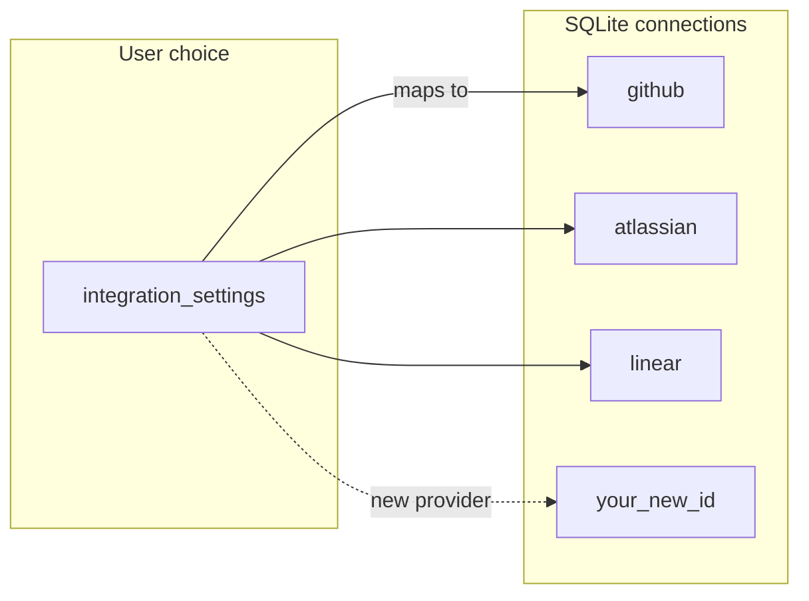

# New connection / provider skill

Use this skill when adding support for a **new external system** (or a new **credential row** + **sync path**) in DevDash—not when only tweaking UI copy for an existing integration.

**System overview** (categories, SQLite cache model, IPC): read [`docs/architecture.md`](../../../docs/architecture.md) first. This skill is a **checklist**; it does not repeat that document.

---

## Concepts (quick)

- **Category** — One of `code` | `work` | `docs`. User picks **one active provider per category** in `integration_settings` (see [`electron/db/integration-settings.ts`](../../../electron/db/integration-settings.ts)).
- **Provider** — Logical product (e.g. `linear`, `jira`, `github`). Drives which sync tasks run and which stats path executes.
- **Connection** — A row in `connections` with `id` (`ConnectionId`), encrypted token, and optional `email` / `org` (meaning is vendor-specific). **Adding a new vendor usually means a new `ConnectionId` string** and a new settings card—not only a new provider enum.

---

## Before you code

1. **Decide the category** (`code` / `work` / `docs`) and whether this is a **new provider** for that category or an alternate auth path for an existing one.
2. **Decide `ConnectionId`** — short, stable primary key (e.g. `notion`, `bitbucket`). Must match the `connections.id` pattern used in [`electron/db/connections.ts`](../../../electron/db/connections.ts).
3. **List APIs**: auth (PAT, OAuth, API key), base URLs, rate limits, and how you **match a Dashboard “developer”** to the remote user (username, email, account id, etc.).
4. **Cache shape**: prefer **dedicated tables** per provider when payloads differ; use consistent `sync_log.data_type` strings (see architecture doc).

---

## Implementation checklist

Work top-to-bottom; skip steps that do not apply (e.g. no new connection row if reusing `atlassian`).

### 1. Types and validation

- [`electron/integrations/types.ts`](../../../electron/integrations/types.ts) — Add provider id types (`WorkProviderId`, `CodeProviderId`, or `DocsProviderId`) and extend `IntegrationProviderId` / `IntegrationSettingsState` / `DEFAULT_INTEGRATION_SETTINGS` as needed.
- [`electron/db/integration-settings.ts`](../../../electron/db/integration-settings.ts) — Extend `isWorkProviderId` (etc.) and any normalization so invalid DB rows cannot crash reads.
- [`electron/integrations/connection-routing.ts`](../../../electron/integrations/connection-routing.ts) — Map `(category, provider)` → `getConnection(...)`; update `needsAtlassianConnection` (or equivalent) if Atlassian is shared across Jira + Confluence only.

### 2. Connection storage and IPC

- [`electron/db/connections.ts`](../../../electron/db/connections.ts) — Add the new literal to `ConnectionId`.
- [`electron/ipc/connections.ts`](../../../electron/ipc/connections.ts) — Allow the new `id` in `connections:upsert` / validation (mirror existing `github` / `atlassian` / `linear` rules).
- **Migration** — Usually **no schema change** for `connections`; new rows appear on first save. If you add columns, add a migration in [`electron/db/schema.ts`](../../../electron/db/schema.ts).

### 3. Settings UI (credentials)

- [`src/pages/settings/Connections.tsx`](../../../src/pages/settings/Connections.tsx) — Add a card (or fields) for the new connection: token/key, site slug, OAuth placeholder, etc. Gate visibility with `integration` from `integrations:get` so users only see relevant forms.
- If the user can **select** the new provider, add an option to the category dropdown / `integrations:set-provider` flow already on that page.

### 4. Integration IPC (provider selection)

- [`electron/ipc/integrations.ts`](../../../electron/ipc/integrations.ts) — No change unless you add a **new category** (rare). Provider ids are validated via `setIntegrationProvider`.

### 5. SQLite cache and migrations

- [`electron/db/schema.ts`](../../../electron/db/schema.ts) — New `CREATE TABLE` for provider-specific cache; indexes for `(developer_id, …)` query patterns.
- Document new `sync_log.data_type` value(s) in a short comment near the sync implementation.

### 6. Service layer (HTTP / GraphQL)

- Add `electron/services/<vendor>.ts` — Thin client: auth headers, pagination, typed-ish responses. Keep side effects out of this layer where possible.

### 7. Sync

- Add `electron/sync/<vendor>-sync.ts` — Load `getConnection("<id>")`, resolve developer identity (see below), read assigned **data sources**, call service, **upsert** cache rows, update **`sync_log`** (`ok` / `error` / `syncing`, optional `last_cursor`).
- [`electron/integrations/sync-registry.ts`](../../../electron/integrations/sync-registry.ts) — Register `{ id, label, category, provider, run }` entries so [`electron/sync/engine.ts`](../../../electron/sync/engine.ts) picks them up via `getRegisteredSyncTasks()`.
- [`electron/sync/engine.ts`](../../../electron/sync/engine.ts) — Extend **`pruneStaleData`** and the **orphan table list** to include new cache tables.

### 8. Developer identity

- If matching is not covered by `github_username` or [`getWorkEmailForDeveloper`](../../../electron/db/developer-identity.ts), extend [`developer_integration_identity`](../../../electron/db/developer-identity.ts) payloads and/or the developer edit UI, and read that in sync.

### 9. Data sources

- [`electron/types.ts`](../../../electron/types.ts) and [`src/lib/types.ts`](../../../src/lib/types.ts) — New `DataSourceType` value if users assign scoped resources (team, workspace, database, etc.).
- [`electron/db/sources.ts`](../../../electron/db/sources.ts) — `defaultProviderForType()` mapping for `provider_id` on insert.
- [`electron/ipc/sources.ts`](../../../electron/ipc/sources.ts) — Usually unchanged if `type` is passed through.
- [`src/pages/settings/Sources.tsx`](../../../src/pages/settings/Sources.tsx) — Show the new section when `integrations:get` implies that provider; add discover combobox + form branch.
- [`electron/ipc/discover.ts`](../../../electron/ipc/discover.ts) — `discover:<vendor>:…` handlers using `getConnection`.

### 10. Stats and context

- [`electron/ipc/stats-context.ts`](../../../electron/ipc/stats-context.ts) — Expose new `ConnectionRecord`, filters (e.g. list of remote ids from sources), or flags.
- [`electron/ipc/stats.ts`](../../../electron/ipc/stats.ts) — Branch on `ctx.integration.<category>` (or equivalent): **cache-first**, `syncDeveloper(..., { silent: true })` on miss, live fetch fallback. Reuse existing domain types when possible (e.g. map remote issues into `JiraTicket`-shaped objects) so dashboard components stay stable.
- [`src/lib/types.ts`](../../../src/lib/types.ts) — Extend response types with `providerId` / `_syncedAt` if needed.

### 11. Reference tables and other IPC

- [`electron/ipc/reference.ts`](../../../electron/ipc/reference.ts) — If the reference grid should reflect the active provider, branch on `getIntegrationSettings()` (see tickets: Jira vs Linear).
- [`electron/ipc/reviews.ts`](../../../electron/ipc/reviews.ts) — Only if the feature is PR/review related (today: GitHub-only guard).
- [`electron/db/cache.ts`](../../../electron/db/cache.ts) — Read helpers for the new tables.

### 12. Export / import

- [`electron/ipc/settings-io.ts`](../../../electron/ipc/settings-io.ts) — If there is a new `ConnectionId`, include it in the import loop that restores **non-secret** metadata (`email`, `org` only—never tokens or `connected` flags).

### 13. Documentation

- Update [`docs/architecture.md`](../../../docs/architecture.md) **only** if you change cross-cutting behavior (new category, new diagram-worthy flow, or new canonical IPC channel).

---

## Conventions

- **Naming**: `sync_log.data_type` strings should be **stable** and unique per sync pipeline (e.g. `notion_pages`).
- **Security**: tokens only in main process, encrypted via existing [`electron/db/crypto.ts`](../../../electron/db/crypto.ts) path; renderer sees masked bullets.
- **Empty states**: return safe empty arrays / zeros from stats handlers; avoid throwing when connection is missing—match patterns in [`electron/ipc/stats.ts`](../../../electron/ipc/stats.ts).
- **Dashboard sections**: if you add a **new** dashboard block (not just a new provider behind `stats:work`), also follow [`.agents/skills/dashboard-section/SKILL.md`](../dashboard-section/SKILL.md).

---

## Verification

- `npm run electron:compile`
- `npm run build`
- Manual: save connection → assign data source → assign developer → trigger sync → confirm dashboard + reference + settings survive restart.
