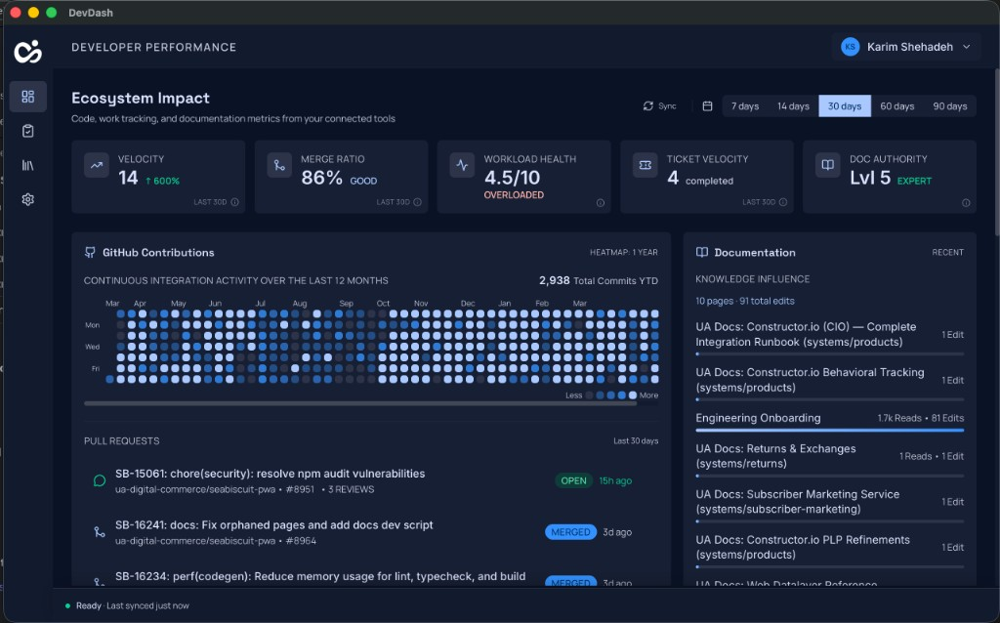

# DevDash

A desktop developer dashboard that aggregates your code, work tracking, and documentation activity into a single view. Connect your tools — GitHub, Jira, Linear, Confluence — and get a real-time picture of your engineering impact.



## Features

- **Ecosystem Impact metrics** — velocity, merge ratio, workload health, ticket throughput, and documentation authority at a glance
- **GitHub contributions** — heatmap, pull request history, and effort distribution (feature / bug fix / review)
- **Work tracking** — Jira or Linear issues with status categories and workload scoring
- **Documentation** — Confluence page edits, reads, and knowledge influence
- **Multi-developer support** — track metrics for yourself or your team
- **Offline-first** — SQLite cache with background sync so the dashboard loads instantly
- **Auto-updates** — built-in update mechanism via GitHub Releases

## Download

DevDash is distributed as a macOS `.dmg`. Grab the latest release from [GitHub Releases](https://github.com/kshehadeh/devdash/releases).

| Architecture | File |
|---|---|
| Apple Silicon (M1+) | `DevDash-<version>-arm64.dmg` |
| Intel | `DevDash-<version>-x64.dmg` |

After downloading, open the `.dmg` and drag **DevDash** into your Applications folder. On first launch, macOS may ask you to allow the app in **System Settings > Privacy & Security**.

## Development

### Prerequisites

- [Node.js](https://nodejs.org/) 20+
- [Bun](https://bun.sh/) (used as the package manager and script runner)

### Setup

```bash
git clone https://github.com/kshehadeh/devdash.git
cd devdash
bun install
```

If `better-sqlite3` fails to build against Electron's Node headers, run:

```bash
bun run electron:rebuild
```

### Running locally

```bash
bun run dev
```

This starts Vite (renderer) and the Electron main process concurrently. The app will open automatically once the dev server is ready.

### Building a distributable

```bash
# Local build (skips code-signing and notarization)
bun run electron:build:local

# Signed + notarized build for distribution
bun run electron:build
```

Output goes to `dist-electron/`.

## Architecture

DevDash is an Electron app with a **Vite + React** renderer and a **Node.js main process** that owns SQLite, encrypted credentials, background sync, and vendor API clients. Communication between the two happens over IPC.

The product is organized around three integration categories — **Code**, **Work**, and **Docs** — each backed by a pluggable provider:

| Category | Providers |
|---|---|
| Code | GitHub |
| Work | Jira, Linear |
| Docs | Confluence |

See [docs/architecture.md](docs/architecture.md) for the full system design and [docs/metrics.md](docs/metrics.md) for detailed metric definitions.

## Contributing

Contributions are welcome! Here's how to get started:

1. **Fork** the repository and create a feature branch from `main`.
2. **Install dependencies** and make sure `bun run dev` works before you start.
3. **Make your changes** — keep commits focused and follow [Conventional Commits](https://www.conventionalcommits.org/) (e.g. `feat:`, `fix:`, `docs:`).
4. **Test locally** — run the app and verify your changes work end-to-end.
5. **Open a pull request** against `main` with a clear description of what changed and why.

### Adding a new integration provider

If you want to add support for a new tool (e.g. Bitbucket, Notion, GitLab), see the [architecture doc](docs/architecture.md#extending-with-a-new-provider-checklist) for the full checklist covering sync tasks, cache tables, IPC handlers, and UI wiring.

## License

This project is private and not currently published under an open-source license.
