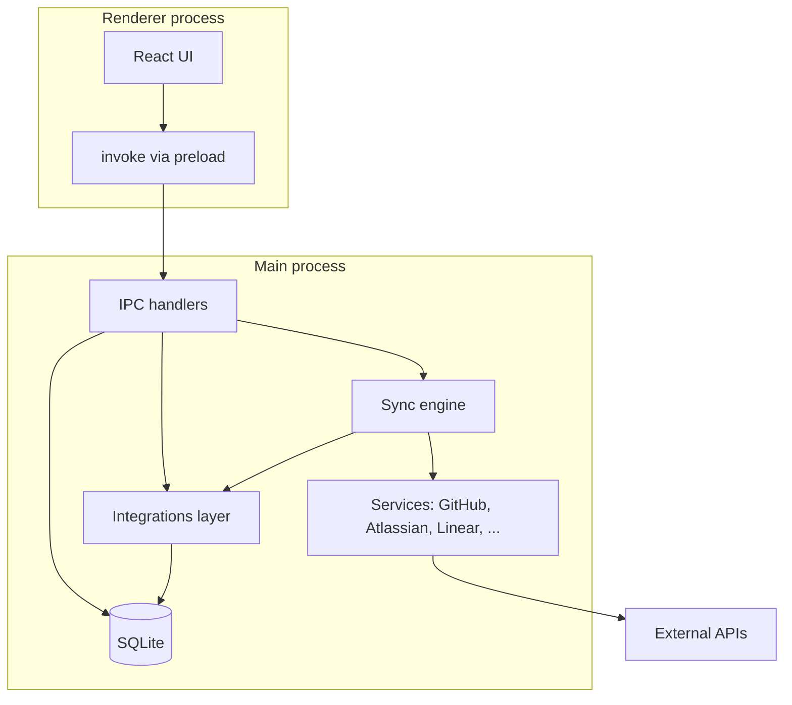
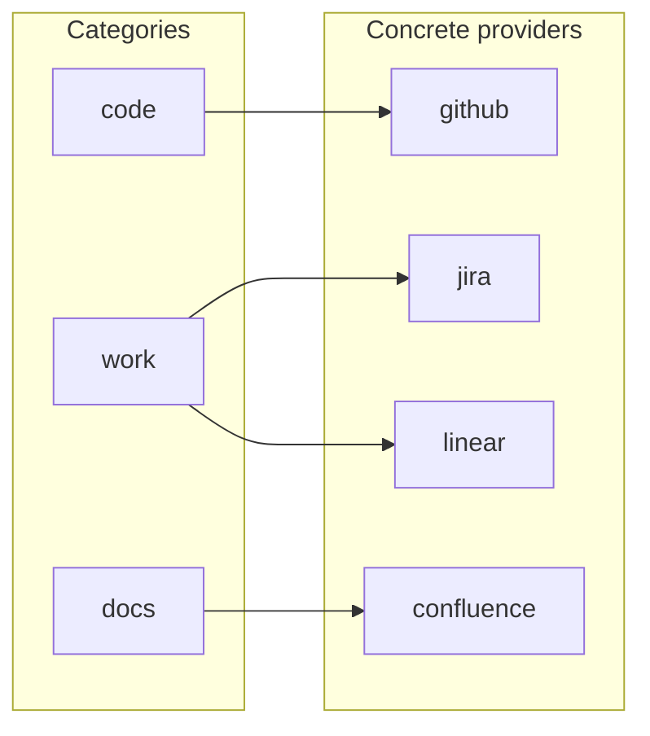
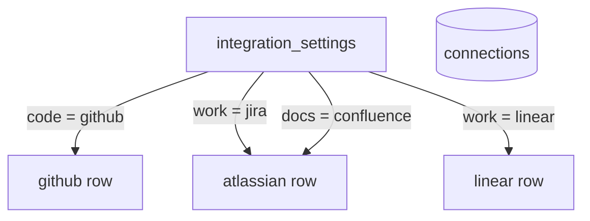
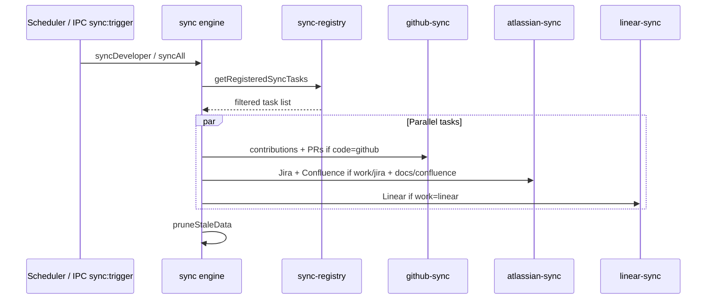

# DevDash architecture

DevDash is an Electron desktop app: a **Vite + React** renderer talks to a **Node/Electron main process** over IPC. The main process owns **SQLite** (via `better-sqlite3`), **encrypted credentials**, **background sync**, and **vendor API clients**. This document summarizes that split and focuses on the **multi-provider integration** model (Code / Work / Documentation).

---

## High-level system

- **Renderer**: dashboard, settings (connections, sources, developers), reference tables. It does not touch tokens or the database directly.
- **Main**: registers handlers in [`electron/ipc/`](../electron/ipc/index.ts), runs scheduled and on-demand sync from [`electron/sync/engine.ts`](../electron/sync/engine.ts), and reads/writes cache tables through [`electron/db/`](../electron/db/).

---

## Integration categories and providers

The product is organized around three **categories**. Each category has exactly one **active provider** at a time (stored in `integration_settings`).

| Category | Role | Supported providers (today) |
|----------|------|-----------------------------|
| **code** | Repositories, PRs, contribution-style metrics | GitHub |
| **work** | Issues / tickets assigned to the developer | Jira (Atlassian), Linear |
| **docs** | Documentation activity | Confluence (Atlassian) |

**Types and defaults** live in [`electron/integrations/types.ts`](../electron/integrations/types.ts). **Which provider is selected** is read/written via [`electron/db/integration-settings.ts`](../electron/db/integration-settings.ts) and exposed to the UI as `integrations:get` / `integrations:set-provider` ([`electron/ipc/integrations.ts`](../electron/ipc/integrations.ts)).

---

## Connections vs integration settings

**Connections** (`connections` table) hold **secrets and connection metadata** (encrypted token, email, org/site slug, `connected` flag). Row IDs are stable integration keys:

- `github` — PAT + default org hint  
- `atlassian` — site subdomain, API user email, API token (powers **Jira** and/or **Confluence** depending on active providers)  
- `linear` — API key + workspace slug (for deep links)

**Integration settings** only store **which provider backs each category**, not credentials.

**Routing** from “active provider” → “which connection row to load” is centralized in [`electron/integrations/connection-routing.ts`](../electron/integrations/connection-routing.ts). [`needsAtlassianConnection`](../electron/integrations/connection-routing.ts) is true when either work is Jira or docs is Confluence, so a single Atlassian credential can still serve both products.

---

## Sync registry and tasks

The sync engine no longer hard-codes four fixed jobs. It asks [`getRegisteredSyncTasks()`](../electron/integrations/sync-registry.ts) for the list of **sync tasks** that match the current `integration_settings`. Each task has a human-readable label and a `run(developerId)` function.

Examples of logical `sync_log.data_type` keys (not an exhaustive enum in SQL after older migrations):

- GitHub: `github_contributions`, `github_pull_requests`  
- Jira: `jira_tickets`  
- Confluence: `confluence_pages`  
- Linear: `linear_issues`

After a full `syncAll`, [`pruneStaleData()`](../electron/sync/engine.ts) applies **time-based cleanup** per cache table (and removes orphans when developers are deleted). New provider caches must be wired into that prune list when added.

---

## SQLite cache model

The design keeps **provider-specific tables** where row shapes differ, rather than one universal “work item” table:

| Cache table | Provider / use |
|-------------|----------------|
| `cached_contributions`, `cached_pull_requests`, `cached_review_requests` | GitHub |
| `cached_jira_tickets` | Jira |
| `cached_confluence_pages` | Confluence |
| `cached_linear_issues` | Linear |

`sync_log` rows track **last sync**, **status** (`ok` / `error` / `syncing`), **cursor** where incrementally supported, and optional error text.

**Read path for the dashboard**: [`electron/db/cache.ts`](../electron/db/cache.ts) exposes helpers. For **work**, Linear rows can be **mapped into the same ticket-shaped type** the UI already uses for Jira, so presentation components stay domain-oriented while storage stays vendor-specific.

---

## Developer identity (work email, GitHub user)

Legacy columns on `developers` (`github_username`, `atlassian_email`) remain for compatibility and UI. The table **`developer_integration_identity`** stores a **JSON payload per (developer, category)** (e.g. work email for Jira/Linear resolution). Helpers in [`electron/db/developer-identity.ts`](../electron/db/developer-identity.ts) merge legacy fields with identity rows; **work email** for Atlassian/Linear matching comes from [`getWorkEmailForDeveloper`](../electron/db/developer-identity.ts).

---

## Data sources

Global resources (repos, Jira projects, Confluence spaces, Linear teams) live in **`data_sources`** with a flexible `type` string and optional **`provider_id`** (migration rebuilt the table to drop the old narrow `CHECK`). Per-developer assignment uses **`developer_sources`**.

The **Sources** settings UI loads **`integrations:get`** and only shows sections for the **active** providers (e.g. Linear teams when work = Linear).

---

## IPC surface (domain-oriented stats)

Stats handlers resolve context via [`getStatsContext`](../electron/ipc/stats-context.ts) (developer, filters from assigned sources, active integration settings, and the right `ConnectionRecord`s).

**Preferred channels** (used by the dashboard today):

| Channel | Payload focus |
|---------|----------------|
| `stats:code` | Commits, PRs, effort (alias: `stats:github`) |
| `stats:velocity` | PR-based velocity / merge ratio (GitHub-only when code = GitHub) |
| `stats:work` | Tickets / issues (alias: `stats:tickets`) |
| `stats:docs` | Documentation stats (alias: `stats:confluence`) |

Discovery follows the same product split, e.g. `discover:github:*`, `discover:jira:*`, `discover:confluence:*`, `discover:linear:teams`.

---

## Settings export / import

Menu-driven export/import ([`electron/ipc/settings-io.ts`](../electron/ipc/settings-io.ts)) writes **version 2** JSON including **`integration`** (code/work/docs provider IDs). It never exports tokens; import restores metadata and integration choice, not secrets.

---

## Extending with a new provider (checklist)

1. Add provider id to [`electron/integrations/types.ts`](../electron/integrations/types.ts) and validation in [`integration-settings.ts`](../electron/db/integration-settings.ts).  
2. Add `ConnectionId` and IPC `connections:upsert` allow-list if a new credential row is needed.  
3. Register **sync tasks** in [`sync-registry.ts`](../electron/integrations/sync-registry.ts); implement sync in `electron/sync/<provider>-sync.ts`.  
4. Add **cache table(s)** + **migration**; extend **prune** in [`engine.ts`](../electron/sync/engine.ts).  
5. Implement **service** + **discover** handlers; add **data source** `type` / UI in Sources.  
6. Extend **stats** and **reference** handlers to branch on `getIntegrationSettings()` where the UI shows vendor-specific data.  
7. Update **Connections** UI for new credentials.

This matches the plan’s intent: **categories stay stable**, **providers plug in** behind explicit sync/cache/stats/discovery wiring, and the **renderer stays oriented to Code / Work / Docs** with `providerId` used mainly for labels, links, and empty states.
