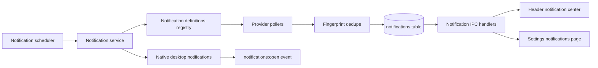

# DevDash notification system

This document describes the integration notification system: how notifications are produced, stored, polled, configured, and shown in the app.

## Goals

- Notify users about meaningful integration events (GitHub/Jira/Confluence).
- Deduplicate events using provider-specific fingerprints.
- Support read/unread lifecycle and sorting for in-app notification center.
- Show native desktop notifications and route click actions back into app details.
- Keep polling scoped and configurable.

## End-to-end flow

## Backend architecture

### Core modules

- Scheduler: `electron/notifications/scheduler.ts`
- Polling + insertion orchestration: `electron/notifications/service.ts`
- Notification definitions and provider-specific polling: `electron/notifications/registry.ts`
- Desktop notification dispatch: `electron/notifications/desktop.ts`
- Event fanout for renderer updates/open actions: `electron/notifications/events.ts`
- IPC surface: `electron/ipc/notifications.ts`

### Polling model

- Polling runs on an interval (`notifications_poll_interval_ms`) with a default.
- Polling target is the developer marked `is_current_user = 1`.
- Only notification definitions for active integrations are considered.
- Global enable/disable is controlled by `notifications_enabled`.

### Notification definitions

A definition in `registry.ts` includes:

- `integration` (e.g. `github`, `jira`)
- `notificationType` (stable identifier)
- `label` (settings display)
- `defaultEnabled`
- `strategy` metadata (`id`, `version`)
- `poll(developerId)` to fetch candidate events
- `fingerprint(event)` to derive dedupe key

This keeps dedupe logic customizable per integration and notification type.

## Database model

Migration: `electron/db/schema.ts` (v14).

### `notifications`

Stores concrete delivered events:

- `id`
- `developer_id`
- `integration`
- `notification_type`
- `fingerprint`
- `title`, `body`
- `payload_json`
- `source_url`
- `status` (`new` | `read`)
- `event_updated_at`
- `created_at`
- `read_at`

Deduplication is enforced by:

- `UNIQUE (developer_id, integration, notification_type, fingerprint)`

### `notification_preferences`

Per notification-type settings:

- `integration`
- `notification_type`
- `enabled`
- `fingerprint_strategy_json`
- `updated_at`

## Renderer behavior

### Notification center

Component: `src/components/notifications/NotificationCenter.tsx`.

- Always-present bell icon in headers.
- Unread badge overlay.
- Dropdown list sorted by unread first, then most recent.
- Click item:
  - marks notification read
  - opens details modal
- Includes “Mark all read”.

Integrated in:

- `src/components/layout/TopBar.tsx`
- `src/components/layout/SettingsLayout.tsx`
- `src/components/layout/ReferenceLayout.tsx`

### Settings page

Page: `src/pages/settings/Notifications.tsx` (`/settings/notifications`).

- Global notifications toggle.
- Poll interval control.
- Per-notification type enable/disable controls.

## IPC contract

`electron/ipc/notifications.ts` provides:

- `notifications:list`
- `notifications:get`
- `notifications:mark-read`
- `notifications:mark-all-read`
- `notifications:unread-count`
- `notifications:preferences:get`
- `notifications:preferences:set`
- `notifications:config:get`
- `notifications:config:set`
- `notifications:check-now`

Renderer receives push events via preload:

- `notifications:open` (desktop click -> open details)
- `notifications:changed` (refresh notification menu state)

## Current built-in notification types

- GitHub: `review_requested`
- Jira: `assigned_or_watched_ticket_updated`
- Confluence: `page_activity`

## Operational notes

- Native notifications may appear as “Electron” in local dev; packaged builds use app bundle identity.
- Menu currently requests up to 50 notifications and uses internal scrolling for long lists.
- Fingerprint strategy metadata is persisted so strategy evolution can be managed safely over time.
