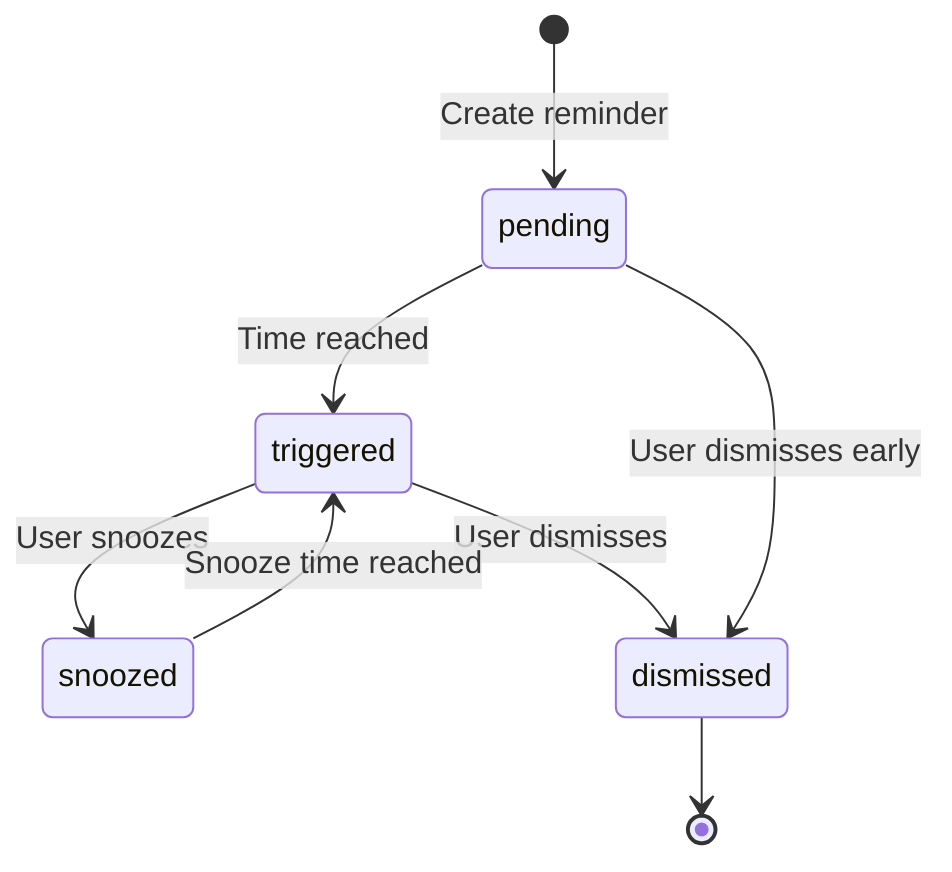

# DevDash reminders system

This document describes the reminder system architecture, macOS integration, and bidirectional sync behavior.

## Overview

The reminder system allows users to schedule notifications for future events. Reminders can be created manually or from context menus on pull requests, tickets, and documentation items. When a reminder's scheduled time arrives, it triggers a desktop notification and appears in the reminders list.

## Architecture

### Backend modules

- **Database**: `electron/db/reminders.ts` — CRUD operations for reminder storage
- **Scheduler**: `electron/reminders/scheduler.ts` — Periodic polling for due reminders and macOS sync
- **Events**: `electron/reminders/events.ts` — Event emitter for frontend state updates
- **macOS integration**: `electron/reminders/macos-integration.ts` — AppleScript bridge for macOS Reminders app
- **IPC handlers**: `electron/ipc/reminders.ts` — Renderer-to-main IPC surface

### Frontend modules

- **Page**: `src/pages/reminders/RemindersPage.tsx` — Main reminders list and filtering UI
- **Dialog**: `src/components/reminders/ReminderDialog.tsx` — Create/edit reminder form
- **Banner**: `src/components/reminders/TriggeredRemindersBanner.tsx` — Dashboard banner for triggered reminders
- **Snooze**: `src/components/reminders/SnoozePopover.tsx` — Quick snooze options (15m, 1h, 4h, tomorrow)

## Database model

Migration: `electron/db/schema.ts` (v18).

### `reminders`

Stores all reminders:

- `id` — UUID
- `developer_id` — Foreign key to developers table
- `title` — Reminder title
- `comment` — Optional description/notes
- `source_url` — Optional external link (e.g., PR, ticket, doc URL)
- `remind_at` — ISO timestamp for when to trigger
- `status` — `pending` | `triggered` | `snoozed` | `dismissed`
- `snoozed_until` — ISO timestamp if snoozed
- `synced_to_macos` — Boolean flag indicating if created in macOS Reminders
- `created_at`
- `updated_at`

## Reminder lifecycle

### Status transitions

- **pending** → **triggered**: Automatic when `remind_at` time is reached (scheduler checks every minute)
- **triggered** → **snoozed**: User clicks snooze and picks a future time
- **snoozed** → **triggered**: Automatic when `snoozed_until` time is reached
- **triggered** → **dismissed**: User dismisses the reminder
- **pending** → **dismissed**: User dismisses a future reminder before it triggers

## Scheduler behavior

`startReminderScheduler()` runs two polling loops:

1. **Due reminder check** (every 60 seconds)
   - Queries reminders where `remind_at <= now` and `status IN ('pending', 'snoozed')`
   - Updates status to `triggered`
   - Shows desktop notification
   - Creates a notification entry in the notifications table for the notification center
   - Emits `reminders:changed` event to refresh renderer

2. **macOS sync** (every 10 minutes, plus once after 30 seconds on startup)
   - Only runs if `reminders_sync_macos` config is `"1"` and platform is macOS
   - Queries all active DevDash reminders where `synced_to_macos = 1`
   - Fetches incomplete reminders from macOS Reminders "DevDash" list
   - Compares titles: if a DevDash reminder is not found in macOS incomplete list, it was completed or deleted in macOS
   - Marks missing reminders as `dismissed` in DevDash
   - Emits `reminders:changed` if any updates occurred

## macOS Reminders integration

### AppleScript bridge

The macOS integration uses AppleScript executed via `osascript` to communicate with the Reminders app. All scripts are written to temporary files and executed with a 10-second timeout.

### Operations

- **isMacOSRemindersAvailable()** — Checks if Reminders app is accessible (macOS only)
- **getMacOSReminderLists()** — Fetches list of all reminder lists
- **ensureMacOSReminderList(listName)** — Creates "DevDash" list if it doesn't exist
- **createMacOSReminder(reminder, listName)** — Creates a reminder in macOS with due date, title, and notes
- **getMacOSRemindersStatus(listName)** — Returns incomplete reminders from the "DevDash" list (limited to 100 for performance)
- **completeMacOSReminder(title, listName)** — Marks a macOS reminder as completed (unused currently)
- **deleteMacOSReminder(title, listName)** — Deletes a macOS reminder by title

### String escaping

AppleScript requires special character handling:
- Backslashes: `\` → `\\`
- Quotes: `"` → `\"`
- Newlines: `\n` → `\\n`

### Bidirectional sync flow

1. **DevDash → macOS** (immediate)
   - When user creates a reminder in DevDash **and** `reminders_sync_macos` is enabled:
     - Reminder is created in DevDash database with `synced_to_macos = 1`
     - `createMacOSReminder()` is called to create it in the macOS Reminders "DevDash" list
     - Reminder title, due date, and notes are synced

2. **macOS → DevDash** (every 10 minutes)
   - Scheduler fetches incomplete reminders from macOS "DevDash" list
   - Compares with DevDash reminders that have `synced_to_macos = 1`
   - If a DevDash reminder is missing from macOS incomplete list, it was completed/deleted in macOS
   - DevDash marks it as `dismissed`

### Sync configuration

- Config key: `reminders_sync_macos` (stored in `config` table)
- Values: `"0"` (disabled) or `"1"` (enabled)
- UI toggle: Settings gear in Reminders page header (only visible on macOS)
- When toggled on, future reminders will be synced to macOS
- When toggled off, sync stops but existing macOS reminders are not deleted

### Limitations

- Sync is one-way for completion: DevDash dismissals do not complete macOS reminders
- macOS reminders deleted outside DevDash will trigger dismissal in DevDash
- Reminders are matched by exact title string (case-sensitive)
- Large macOS reminder lists (>100 incomplete) are truncated for performance
- Snoozing in DevDash does not update the due date in macOS

## IPC contract

`electron/ipc/reminders.ts` provides:

- `reminders:list` — Get all reminders for current developer, optional status filter
- `reminders:get` — Get single reminder by ID
- `reminders:create` — Create new reminder (with optional macOS sync)
- `reminders:update` — Update reminder fields (title, comment, remind_at, source_url)
- `reminders:delete` — Hard delete a reminder (also deletes from macOS if synced)
- `reminders:dismiss` — Mark reminder as dismissed
- `reminders:snooze` — Update reminder status to snoozed with new `snoozed_until`
- `reminders:config:get` — Get sync settings and macOS availability
- `reminders:config:set` — Update `reminders_sync_macos` config

Renderer receives push events:

- `reminders:changed` — Refresh reminder list
- `reminders:navigate` — Navigate to triggered reminder (from desktop notification click)

## Context menu integration

Context menus on dashboard items (PRs, tickets, docs) include a "Remind Me" option that opens a time picker. Selecting a time creates a reminder with the item's title and URL pre-filled.

Implementation:
- Context menu action: `remind-me` with `remindAt` ISO timestamp
- Listener in `Dashboard.tsx` intercepts action and calls `reminders:create` IPC
- Title is prefixed with item type: `PR: ...`, `Ticket: ...`, or `Doc: ...`
- `source_url` is populated with the item's external link

## Notifications integration

When a reminder triggers, a notification entry is created in the notifications table:

- `integration`: `"reminder"`
- `notification_type`: `"reminder_triggered"`
- `fingerprint`: `"${reminderId}:${remindAt}"` (dedupe by reminder ID and trigger time)
- `title`: Reminder title
- `body`: Reminder comment
- `payload`: `{ reminderId }`
- `source_url`: Reminder source URL

This surfaces the reminder in the notification center dropdown alongside integration notifications (GitHub, Jira, Confluence).

## UI behavior

### Reminders page

- **Sidebar filters**: All, Pending, Triggered, Snoozed, Dismissed
- **Sorting**: Triggered first, then untriggered (pending/snoozed), then dismissed; within each group, sorted by `remind_at` ascending
- **Dismissed filter**: Shows only last 30 days to avoid clutter
- **Badges**: Color-coded status badges (blue=pending, red=triggered, amber=snoozed, gray=dismissed)
- **Stale indicator**: Past-due reminders show time as "Past due"
- **Actions**:
  - Edit (pending only, before due)
  - Delete (pending only, before due)
  - Snooze (triggered/snoozed only)
  - Dismiss (triggered/snoozed only)

### Dashboard banner

`TriggeredRemindersBanner` appears at the top of the dashboard when there are triggered reminders. Clicking navigates to the Reminders page with `status=triggered` filter.

### Desktop notifications

Native Electron notifications trigger when reminders are due. Clicking the notification:
1. Restores and focuses the app window if minimized
2. Navigates to the Reminders page
3. Filters to `status=triggered`
4. Highlights the clicked reminder (frontend listener via `reminders:navigate`)

## Testing notes

- Scheduler checks every 60 seconds, so reminders may trigger up to 1 minute after their scheduled time
- macOS sync runs every 10 minutes, so dismissals in macOS may take up to 10 minutes to reflect in DevDash
- Manual sync from macOS can be triggered by calling `manualSyncFromMacOS()` (no UI currently)
- Desktop notifications may show as "Electron" in development builds; production uses app bundle identity
- AppleScript execution requires macOS Automation permissions for Terminal or the app bundle

## Future improvements

- Two-way sync: dismissing in DevDash should complete macOS reminder
- Snooze sync: update macOS due date when snoozed in DevDash
- Manual sync button in Reminders page settings
- Recurring reminders support
- Reminder templates for common scenarios (standup, review PR, follow-up)

## See also

- [Features](./features.md) — **My Day** surfaces triggered reminders; **command palette** can search `reminders` by title
